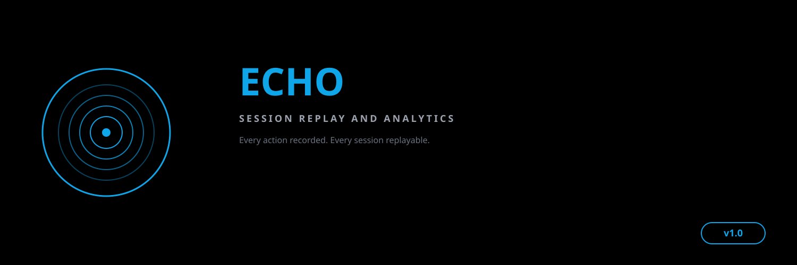

> **Session Replay and Analytics for Claude Code**
> Record every tool use, replay entire sessions, compute metrics, and visualize team performance.

## Why Echo?

In Greek mythology, Echo was a mountain nymph cursed by Hera to only repeat the last words spoken to her. She could never speak first — only reflect what others said. ECHO transforms this concept of faithful repetition into a developer tool: it captures every action in a Claude Code session and can perfectly replay them, like Echo repeating words in a mountain valley. Every tool use, every command, every result is faithfully recorded and reflected back, enabling deep analysis of how you work.

## Features

| Module | Description |
|---|---|
| **Session Recorder** | Capture every event with timestamps, persist to JSON |
| **Replay Engine** | Reconstruct timelines, navigate with cursor, filter & search |
| **Analytics** | Tools used, time per task, cost per session, error rate |
| **Team Dashboard** | Aggregate metrics across team members, leaderboards |
| **Export** | CSV and JSON export for reports and data portability |
| **PostToolUse Hook** | Auto-record every tool use via Claude Code hooks |

## Quick Start

```bash
# Install
cd ~/echo && npm install

# Set up the hook in ~/.claude/settings.json
{
  "hooks": {
    "PostToolUse": [{
      "matcher": "",
      "hooks": [{
        "type": "command",
        "command": "python3 ~/echo/hooks/echo-recorder.py"
      }]
    }]
  }
}

# Use the CLI
node bin/echo-cli.mjs list
node bin/echo-cli.mjs replay <session-id>
node bin/echo-cli.mjs analyze
```

## Programmatic Usage

```js
import {
  SessionRecorder,
  ReplayEngine,
  AnalyticsEngine,
  TeamDashboard,
  ExportManager,
} from './lib/index.mjs';

// Record a session
const rec = new SessionRecorder({ userId: 'alice' });
rec.recordToolUse('Bash', { cmd: 'npm test' }, { exit: 0 }, 1200, 0.005);
rec.recordError('Lint failed', { file: 'app.js' });
rec.end();
await rec.save();

// Replay
const engine = new ReplayEngine(rec.toJSON());
console.log(engine.toTextReport());

// Analytics
const analytics = new AnalyticsEngine();
analytics.addSession(rec.toJSON());
console.log(analytics.computeAll());

// Team view
const dash = new TeamDashboard('engineering');
dash.addSession(rec.toJSON());
console.log(dash.summary());

// Export
const mgr = new ExportManager(rec.toJSON());
await mgr.saveCSV('report.csv');
await mgr.saveJSON('report.json');
```

## Architecture


## Testing

```bash
npm test          # Run all 74 tests
npm run test:verbose  # Verbose output
```

## Project Structure

```
echo/
├── lib/
│   ├── index.mjs              # Main entry point
│   ├── session-recorder.mjs   # Event capture & persistence
│   ├── replay-engine.mjs      # Timeline reconstruction
│   ├── analytics.mjs          # Metrics computation
│   ├── team-dashboard.mjs     # Team aggregation
│   └── export.mjs             # CSV/JSON export
├── hooks/
│   └── echo-recorder.py       # PostToolUse hook
├── bin/
│   └── echo-cli.mjs           # CLI interface
├── tests/
│   ├── session-recorder.test.mjs
│   ├── replay-engine.test.mjs
│   ├── analytics.test.mjs
│   ├── team-dashboard.test.mjs
│   └── export.test.mjs
├── docs/
│   ├── architecture.md
│   ├── hook-setup.md
│   └── api-reference.md
├── banner.txt
├── package.json
└── README.md
```

## Documentation

- [Architecture & Diagrams](docs/architecture.md)
- [Hook Setup Guide](docs/hook-setup.md)
- [API Reference](docs/api-reference.md)

## License

MIT
